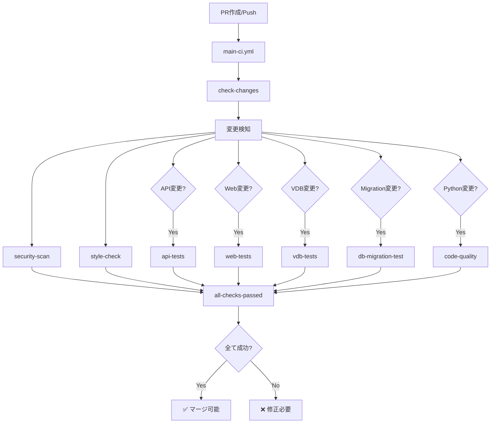

# 🚀 新しいCI/CDワークフロー

このディレクトリには、コード品質を向上させるための新しいCI/CDワークフローが含まれています。

## � バージョン管理戦略

セキュリティと再現性を確保するために、GitHub Actionsのバージョン管理には以下の戦略を採用しています:

### 公式GitHub Actions (`actions/*`, `github/*`)
**コミットハッシュでピン留め**
```yaml
uses: actions/checkout@eef61447b9ff4aafe5dcd4e0bbf5d482be7e7871 # v4.2.2
uses: actions/upload-artifact@6f51ac03b9356f520e9adb1b1b7802705f340c2b # v4.5.0
```

**理由**:
- ✅ 公式アクションは安定したコミットハッシュが提供される
- ✅ 供給チェーン攻撃への対策（タグは変更可能だがコミットは不変）
- ✅ 完全な再現性を保証

### サードパーティActions
**セマンティックバージョンタグを使用**
```yaml
uses: astral-sh/setup-uv@v6
uses: pnpm/action-setup@v4
uses: aquasecurity/trivy-action@0.28.0
```

**理由**:
- ⚠️ サードパーティアクションはコミットハッシュが不安定または利用不可
- ✅ メジャーなアクションを選定し、定期的なアップデートで対応
- ✅ セキュリティアドバイザリを監視

**ピン留めされた公式Actions一覧**:
- `actions/checkout@eef61447b9ff4aafe5dcd4e0bbf5d482be7e7871` (v4.2.2)
- `actions/upload-artifact@6f51ac03b9356f520e9adb1b1b7802705f340c2b` (v4.5.0)

**サードパーティActions一覧**:
- `astral-sh/setup-uv@v6` - UV パッケージマネージャー
- `pnpm/action-setup@v4` - pnpm パッケージマネージャー
- `tj-actions/changed-files@v46` - 変更ファイル検知
- `dorny/paths-filter@v3` - パスフィルター
- `orgoro/coverage@v3.2` - カバレッジレポート
- `aquasecurity/trivy-action@0.28.0` - セキュリティスキャナー
- `jlumbroso/free-disk-space@main` - ディスク容量確保
- `super-linter/super-linter/slim@v8` - 汎用リンター

## �📁 ファイル構成

```
.github/workflows/
├── main-ci.yml              # メインCIパイプライン（エントリーポイント）
├── security.yml             # セキュリティスキャン（NEW!）
├── api-tests.yml            # APIテスト（カバレッジ強制機能追加）
├── web-tests.yml            # Webテスト
├── style.yml                # スタイル・型チェック
├── code-quality.yml         # コード品質チェック（NEW!）
├── vdb-tests.yml            # ベクトルDBテスト
├── db-migration-test.yml    # DBマイグレーションテスト
└── old/                     # 旧ワークフロー（バックアップ）
```

## 🆕 新機能

### 1. セキュリティスキャン (`security.yml`)

**実行タイミング**: PR、main push、毎週日曜日

**スキャン内容**:
- **Python**: Bandit（セキュリティ脆弱性）、Safety（依存関係）、pip-audit
- **Docker**: Trivy v0.28.0（コンテナ脆弱性）
- **Web**: npm audit（依存関係）

**結果**: GitHub Security Advisoriesに統合

### 2. カバレッジ強制 (`api-tests.yml`)

**新機能**:
- ✅ カバレッジ閾値: **75%**（`pytest.ini`に設定済み）
- ✅ PRへの自動コメント投稿（カバレッジレポート）- `orgoro/coverage@v3.2`使用
- ✅ 閾値未達でCI失敗

**カバレッジ閾値の調整**:
```bash
# api/pytest.ini
addopts = --cov=./api --cov-report=json --cov-report=xml --cov-fail-under=75
```

### 3. コード品質チェック (`code-quality.yml`)

**実行タイミング**: Python コード変更時のPR

**チェック内容**:
- **複雑度分析**: Radonで循環的複雑度を測定（D以上でエラー）
- **重複コード**: Pylintで重複コード検出
- **デッドコード**: Vultureで未使用コード検出

### 4. 改善されたDocker Compose管理

**変更点**:
- マイナーな`hoverkraft-tech/compose-action`から公式の`docker compose`コマンドに移行
- より安定した動作とメンテナンス性の向上
- ヘルスチェックとタイムアウト処理を追加

## 🔄 CI/CDフロー



## 📊 必須チェック

以下のチェックが**必須**です（変更の有無に関わらず実行）:
- ✅ **セキュリティスキャン**
- ✅ **スタイルチェック**

以下は**変更があった場合のみ**必須:
- 📝 APIテスト（カバレッジ75%以上）
- 📝 Webテスト
- 📝 VDBテスト
- 📝 DBマイグレーションテスト
- 📝 コード品質チェック

## 🛠️ ローカルでのテスト

### カバレッジチェック
```bash
# APIテスト実行
uv run --project api bash dev/pytest/pytest_unit_tests.sh

# カバレッジ確認
python -c 'import json; c=json.load(open("coverage.json"))["totals"]["percent_covered"]; print(f"Coverage: {c}%"); exit(0 if c >= 75 else 1)'
```

### セキュリティチェック
```bash
# Bandit
uv pip install bandit
uv run bandit -r api -ll

# Safety
uv pip install safety
uv run safety check

# npm audit
cd web
pnpm audit --audit-level=high
```

### コード品質チェック
```bash
# 複雑度チェック
uv pip install radon
uv run radon cc api --min D

# 重複コード
uv pip install pylint
uv run pylint --disable=all --enable=duplicate-code api

# デッドコード
uv pip install vulture
uv run vulture api --min-confidence 80
```

## 🎯 GitHub Branch Protection Rules

以下の設定を推奨:

**Settings → Branches → Add rule**

1. **Branch name pattern**: `main`

2. **必須チェック**:
   - ✅ `Security Scan / python-security`
   - ✅ `Security Scan / docker-security`
   - ✅ `Security Scan / web-security`
   - ✅ `Style Check / python-style`
   - ✅ `Style Check / web-style`
   - ✅ `API Tests (Python 3.12)` (API変更時)
   - ✅ `Web Tests` (Web変更時)
   - ✅ `Code Quality Checks / complexity-check` (Python変更時)

3. **その他の設定**:
   - ✅ Require a pull request before merging
   - ✅ Require approvals: 1
   - ✅ Require status checks to pass before merging
   - ✅ Require branches to be up to date before merging
   - ✅ Require conversation resolution before merging

## 📈 段階的な閾値引き上げ

現在のカバレッジ閾値: **75%**

### フェーズ1（1ヶ月後）
- カバレッジ閾値を80%に引き上げ
- 複雑度閾値をC（中程度）に厳格化

### フェーズ2（3ヶ月後）
- カバレッジ閾値を85%に引き上げ
- 重複コード検出を必須化

## 🔧 トラブルシューティング

### CI失敗: カバレッジ不足
```bash
# カバレッジレポートで不足箇所を確認
uv run --project api coverage report --show-missing

# 特定ファイルのテストを追加
# tests/unit_tests/test_your_module.py
```

### CI失敗: 複雑度が高い
```bash
# 該当関数を確認
uv run radon cc api --min D

# 関数を小さく分割してリファクタリング
```

### CI失敗: セキュリティ脆弱性
```bash
# 依存関係を更新
uv lock --project api --upgrade-package <vulnerable-package>

# または特定バージョンに固定
# pyproject.toml で修正
```

## 📚 参考資料

- [改善プラン全体](../../CICD_QUALITY_IMPROVEMENT.md)
- [既存CI/CD概要](../../CICD.md)
- [旧ワークフロー](./old/)

## 💡 Tips

### 並列実行を活用
- 独立したジョブは並列実行される
- 変更検知により不要なテストはスキップ

### キャッシュの活用
- UV、pnpm、Dockerレイヤーがキャッシュされる
- 2回目以降の実行は高速

### Fail-Fast
- セキュリティとスタイルチェックを先に実行
- 早期に問題を発見して修正時間を短縮

---

**最終更新**: 2025年11月6日  
**バージョン**: 2.0.0  
**変更内容**: 新規CI/CDワークフロー導入

## 📝 変更履歴

### v2.1.0 (2025-11-06)
- ✅ **公式GitHub Actionsをコミットハッシュでピン留め**
  - `actions/checkout@v4` → `@eef61447b9ff4aafe5dcd4e0bbf5d482be7e7871` (v4.2.2)
  - `actions/upload-artifact@v4` → `@6f51ac03b9356f520e9adb1b1b7802705f340c2b` (v4.5.0)
- ✅ サードパーティActionsはセマンティックバージョンタグで管理
- ✅ セキュリティと再現性の向上

### v2.0.0 (2025-11-06)
- ✅ 新規CI/CDワークフロー導入
- ✅ セキュリティスキャン追加（Bandit, Safety, Trivy）
- ✅ カバレッジ強制機能追加（75%閾値）
- ✅ コード品質チェック追加（複雑度、重複、デッド検出）
- ✅ マイナーなGitHub Actionsをメジャーなものに置き換え:
  - `hoverkraft-tech/compose-action` → 公式`docker compose`コマンド
  - `endersonmenezes/free-disk-space` → `jlumbroso/free-disk-space`
  - `py-cov-action/python-coverage-comment-action` → `orgoro/coverage`
  - `aquasecurity/trivy-action@master` → `aquasecurity/trivy-action@0.28.0`（バージョン固定）
